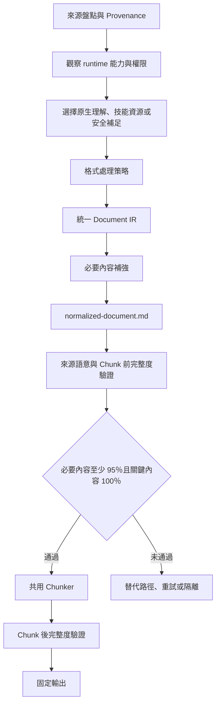

# Multiformat RAG Chunker

> **v1.2.1｜2026-07-30**：正式凍結 dev-r1 至 dev-r4。具來源輸入 SHA-256、圖片 asset SHA-256 與原生視覺審核證據的必要介面圖片，可用 `llm_visual_summary`、`verbatim: false` 產生獨立可檢索 Chunk；它不是 OCR 或 machine payload，絕不要求使用者安裝 Tesseract。未審核的 `screen_capture` 仍安全跳過。正式 release 同時通過全回歸、獨立 Validator、原始 iTest Help corpus、圖片語意與全庫 retrieval smoke、標點及封裝雜湊驗證。
> **v1.2.1-dev-r4｜2026-07-29**：修正獨立圖片的語意路由。可由 decoder 驗證的 QR／Barcode 保留 payload、symbology、來源 SHA-256 與 decoder evidence，且不得再 OCR。具可重現介面版面結構但沒有已驗證機器載荷或雜湊綁定原生視覺審核的圖片，標記為 `screen_capture` 並以既有 `skipped` Block 保留，絕不將 OCR 猜測送入 Chunk。此規則不依 iTest 檔名、路徑或產品特徵；既有格式、固定七類輸出、Markdown、Chunk、命名、manifest 欄位與狀態欄位均不調整。
> **v1.2.1-dev-r3｜2026-07-29**：修正獨立 collection Validator 漏算 XML `param[name=path]` 關聯 occurrence 的缺陷。Validator 仍由原始 XML 獨立重算，不共用 Adapter helper；僅 `name=path` 會形成 `xml_param_value`，其他 `param` 不得誤算。既有 runtime-aware 能力階梯、格式、固定七類輸出、Markdown、Chunk、命名、manifest 欄位與狀態欄位均不調整。
> **v1.2.1-dev-r2｜2026-07-29**：凍結 LLM-first、runtime-aware 的能力選擇與證據契約。Agent 必須先使用當前可用能力、技能資源與安全的自動補足路徑；不得把可由 Agent 處理的相依缺口轉嫁給使用者。既有格式、固定七類輸出、Markdown、Chunk、命名、manifest 欄位與狀態欄位均不調整。
> **v1.2.1-dev-r1｜2026-07-28**：依 iTest Help 原始 ZIP 與批判性複核報告，僅補強已證實的來源語意缺口。XML 可見屬性、非標準 HTML 清單直接子內容、Table Caption、OCR 結構垃圾偵測，以及原始來源獨立語意稽核接入可選工具 lane 與 collection Validator。既有格式、固定七類輸出、Token、overlap、關聯復原與成功條件均不調整。
> **v1.2.0｜2026-07-27**：正式凍結 collection runtime 與原包內部關聯復原。正常 RAG collection 不要求 `collection-supplement.json`；已驗證 Eclipse Help 原包的五個可證明目標會復原，沒有唯一證據的目標維持 `source_missing_target`。非 Eclipse 真實 collection 是後續擴大回歸項目，不是本版凍結前置。
> **v1.2.0-dev-r4｜2026-07-27**：以原始 collection 已存在的 member 建立嚴格的內部關聯復原。只接受相同來源 alias，或唯一 fragment 加明確來源標題／標籤的本包目標。使用者不需提供 manifest；無可驗證候選時保留 `source_missing_target`。
> **v1.2.0-dev-r3｜2026-07-27**：建立補件 provenance 與 relationship assignment 契約，並規劃異質非 Eclipse collection 的實檔回歸。補件 manifest 驗證骨架可執行，但尚未接入 runtime，沒有未取得的內容會被虛構為完成。
> **v1.2.0-dev-r2｜2026-07-26**：將通用 collection inventory、alias、跨檔關聯、已驗證 Eclipse Help 階層、獨立 collection Validator 與根目錄稽核報告接入 ZIP、巢狀 ZIP 與目錄流程。每個內容來源仍維持獨立處理與固定七類輸出。
> **v1.2.0-dev-r1｜2026-07-26**：建立通用 collection 契約、測試矩陣與未接入主流程的實作骨架。collection 是補足整包來源的關係處理，不限縮 HTML、XML 或任何既有格式的支援範圍。
> **v1.1.2｜2026-07-25**：正式定版。完整承接 dev-r1 至 dev-r3 的 DOCX、DOC、PDF 閱讀順序、圖片與 QR Code 章節關聯、Word `Title` 語意、複雜跨欄 PDF 降級及外部 Validator 防繞過修正；完整支援格式、固定七類輸出、Token、overlap、OCR 與退出碼契約維持不變。
> **v1.1.2-dev-r3｜2026-07-25**：修正複雜跨欄 PDF 與檔名推定標題仍誤報完整成功，補強外部 Validator 對 `source_order`、圖片 Heading 關聯、語意能力旗標及 Chunk 後指標的獨立硬閘門，並新增降級與竄改負向回歸。
> **v1.1.2-dev-r2｜2026-07-20**：完成 DOCX、DOC、PDF 的圖片與 QR Code 邏輯閱讀順序、章節關聯及跨格式 Validator 硬閘門，保留 Word `Title` 語意修正，並加入三格式實檔與負向回歸。
> **v1.1.2-dev-r1｜2026-07-20**：修正 DOCX 圖片與 QR Code 的邏輯閱讀順序及章節關聯，辨識 Word `Title` 樣式，並將閱讀順序、圖文關聯與文件標題語意納入 Validator 硬閘門。
> **v1.1.1｜2026-07-18**：正式定版。整合 dev-r2 至 dev-r5 的 Document IR、雙完整度閘門、Heading 修正、表格空白正規化、DrawingML caution，以及 OpenCV 安裝與透明降級修正。
> **v1.1.1-dev-r5｜2026-07-18**：修正 OpenCV 未納入核心安裝清單，以及影像檢查因缺少核心相依而失敗時仍誤判為完整成功；同時依平台與虛擬環境決定 pip 參數。
> **v1.1.1-dev-r4｜2026-07-16**：只修正一般表格文字欄位的空白正規化，並在使用 DrawingML Shape Parser 時留下第三方 Renderer 相容性警告；不修改 Chunker、Validator、OCR、圖片排序或輸出契約。
> **v1.1.1-dev-r3｜2026-07-14**：修正跨兄弟章節 Chunk 的 `heading_path`，改採所有來源 Block 的最長共同 Heading 前綴；Validator 同步驗證語意正確性，並統一標示衍生章節標題。

## 目的

將每個來源獨立轉換成可稽核的 RAG 資料。原始來源不得直接進入 Chunker。Agent 依來源特性與當前 runtime 能力建立統一 Document IR 及 `normalized-document.md`，通過內容完整度閘門後，才產生正式 Chunk。

使用者只需提供來源檔與任務要求。Python、LibreOffice、FFmpeg、Tesseract、OCR、影音、轉檔與連接器是 Agent 依當前能力主動選擇的資源，不是使用者必須自行安裝或執行的前置。

## v1.2.0-dev-r2 collection 開發範圍

- collection 是 ZIP、巢狀 ZIP 或目錄中的多成員來源協調層，不是新的單一檔案格式，也不假定所有 HTML／XML 都採相同網站結構。
- 先使用 generic collection inventory 保留 member、alias、資源與相對路徑。只有在可驗證的控制檔與標記成立時，才選用特定 collection profile；未識別來源一律回退 generic profile。
- 每個內容來源仍各自產生既有七類輸出。collection context 只能補入已驗證的階層、順序與關聯，不得把不同來源的正文無條件混成同一份文件。
- ZIP、巢狀 ZIP 與目錄先建立 Package IR。相同雜湊的 alias 保留獨立 member 身分與 virtual base path，且各自輸出來源目錄。
- `collection-report-<collection-id>.json` 是 collection 根目錄稽核報告，不取代或增加每個來源固定七類輸出。它只記錄 member catalog、profile、控制檔階層、跨檔關聯摘要、collection metrics 與 gate。
- `scripts/validate_collection.py INPUT OUTPUT` 以原始 HTML DOM、XML tree 與 member catalog 獨立重算 collection 關聯、順序與硬閘門。它不得只相信 Adapter 或 `collection-report` 自報資料。
- 詳細契約見 `references/collection-contract.md`；已完成與尚未完成的測試分別記錄於 `references/test-coverage.md`。

## v1.2.0 collection 與內部關聯復原範圍

- 正常 collection 輸入不需要 `collection-supplement.json`。Chunker 必須由原始 ZIP、目錄或巢狀 ZIP 的 member、雜湊、raw reference、fragment 與來源端標題／標籤自行建立解析證據。
- 精確相對路徑、`help::` URI 與副檔名替代維持第一優先。只有精確解析為 `source_missing_target` 時，才可嘗試本包內部復原，且不得跨 collection。
- 可接受的復原只有兩種：完全相同 bytes 的 alias source 能解析相同 raw reference，或唯一候選 member 同時具有所需 fragment 與完全相符的顯式標題／標籤。復原紀錄必須保留 target 與雜湊證據。
- 基於同檔名、模糊文字、OCR、視覺相似、其他版本、網路下載或 LLM 生成的猜測一律禁止。無候選、候選不唯一或證據不完整時維持 `source_missing_target`，collection 維持 `partial_success`。
- 非 Eclipse 真實異質 collection 是後續擴大回歸項目。它在未提供實檔時僅能標示為直接測試覆蓋不足，不能倒推本版已完成的既有格式、generic linked markup fixture、iTest 原包實測或凍結資格無效。
- r3 的 supplement manifest skeleton 是歷史候選，不是 r4 的使用者輸入或 runtime 依賴。iTest 的原包解析結果及驗收邊界見 `references/r4-internal-resolution-contract.md` 與 `references/r3-regression-plan.md`。

## 固定流程



完整流程及狀態轉移見 `references/workflow.md`。

圖片的 decoder、介面截圖、OCR 路由與 release gate 規則見 `references/image-semantics-gate.md`。只可把已驗證的機器載荷、通過既有 OCR 品質檢查的文字，或具來源與 asset SHA-256 證據的非逐字原生視覺摘要送入 Chunk。

## 輸入契約

支援：

- PDF、DOCX、DOC。
- HTML、HTM、XML。
- CSV、Markdown。
- MP4。
- JPG、JPEG、PNG、HEIF、HEIC。
- ZIP、巢狀 ZIP、目錄。

每個來源獨立處理。ZIP 展開後依 SHA-256 去重。禁止將不同來源的內容混進同一個來源目錄。

## Runtime-aware 執行方式

先觀察目前對話已暴露且已授權的檔案理解、視覺、程式、轉檔、OCR、影音、已安裝工具與連接器能力。能力可用的證據只能是目前介面明確提供、未改變持久環境的測試成功，或前一步已成功完成。

依序使用：原生能力、技能包資源、安全可自動補足的相依、等效能力。不可因使用者沒有手動安裝工具而跳過可行處理路徑，也不可要求使用者自行執行技能內的同一腳本。只有所有安全可行路徑都不足時，才依既有狀態欄位回報原因。

下列命令是 Agent 在當前 runtime 可實際執行且適合時可調用的 bundled resource，不是使用者操作說明。

標準命令：

```bash
python scripts/rag_chunker.py INPUT -o OUTPUT
```

若 Agent 已確認當前 runtime 允許隔離且可回復的自動補足：

```bash
python scripts/rag_chunker.py INPUT -o OUTPUT --install-deps
```

允許不完整來源只對已驗證 Block 切片時：

```bash
python scripts/rag_chunker.py INPUT -o OUTPUT --allow-partial-chunks
```

要求原始二進位檔，禁止衍生 Markdown snapshot 降級時：

```bash
python scripts/rag_chunker.py INPUT -o OUTPUT --require-original-binary
```

Forensic 模式只供人工調查：

```bash
python scripts/rag_chunker.py INPUT -o OUTPUT --forensic
```

當原生視覺能力已實際可用且圖片語意是必要內容時，Agent 可建立雜湊綁定的審核 sidecar，並執行：

```bash
python scripts/rag_chunker.py INPUT -o OUTPUT --visual-semantics REVIEW.json
```

`REVIEW.json` 是 Agent 的可稽核工作產物，不是使用者安裝工具或手動準備的前置；它必須同時比對 INPUT 與每張圖片的 SHA-256。

## 執行規則

### 零、能力補足與持久環境邊界

- 不得依產品名稱假定能力。Agent 必須依實際暴露的權限、隔離性、持久性、可回復性與前一步結果決定是否調用或補足能力。
- 在隔離 sandbox，或 Agent 已確認自己擁有受限且可回復的安裝範圍時，缺少相依應由 Agent 自行安裝並實測。
- 在持久或共享環境，優先使用既有工具、暫存路徑、工作區隔離環境或等效能力。不得修改全域設定、移除或升級無關相依。
- 安裝、權限、網路或政策阻擋時，必須嘗試等效能力；不得把可由 Agent 完成的步驟轉嫁給使用者。
- 每次能力選擇、安裝嘗試、等效路徑與失敗原因都必須保留在既有處理或驗證紀錄中。

### 一、先驗證來源身份

至少記錄使用者名稱、上傳名稱、runtime path、副檔名、MIME、magic bytes、SHA-256、實際 Adapter、原始二進位處理狀態、來源尺度及 derivation chain。

若使用者指定 PDF，但 runtime 實際只有 Markdown snapshot，必須標示：

```json
{
  "requested_media_type": "application/pdf",
  "runtime_media_type": "text/markdown",
  "original_binary_processed": false,
  "input_fidelity": "derived_snapshot"
}
```

此情況不得標示完整成功。詳細契約見 `references/adapter-contract.md`。

### 二、Adapter 只產生 Document IR

每個格式 Adapter 只解析來源並輸出統一 Document IR。禁止 Adapter 自行切片。共用 Block type 只有：

- `heading`
- `paragraph`
- `list`
- `table`
- `image`
- `code`
- `transcript`
- `placeholder`

Schema 見 `references/document-ir.md`。

### 三、原生解析優先，必要時才補強

只有原生內容缺失、掃描頁、必要圖片文字、無法取得的表格或資訊圖才執行 OCR。QR Code 及 Barcode 先使用專用 Decoder。Logo、裝飾圖、純照片及已被原生文字完整涵蓋的圖片不得強制 OCR。

一般模式每個失敗單元最多三次，且每次策略必須不同：

1. 原生解析或標準 OCR。
2. 只處理失敗區域，執行解析度、Crop、Deskew、Contrast、Adaptive threshold 及語言調整。
3. 替代 parser 或第二 OCR backend。LLM 視覺摘要只能標示為非逐字內容。

已授權的原生視覺理解若確認介面圖片含有原生文字未涵蓋的必要概念，只可用來源 INPUT SHA-256、asset SHA-256 與 `native_visual_nonverbatim` 審核方法綁定的摘要補入。摘要不得逐字宣稱 OCR 結果、不得偽造 decoder payload，並必須成為單獨可檢索的原子 Chunk；未具此證據的 `screen_capture` 維持跳過且不得 OCR。

詳細失敗政策見 `references/failure-policy.md`。

### 四、先產生標準化 Markdown

集中執行 Unicode NFC、軟換行合併、頁首頁尾移除、重複內容處理、閱讀順序修復及 OCR 垃圾偵測。IPA、數學符號、程式碼及 combining marks 不得被粗暴移除。

每個來源先產生獨立 `normalized-document.md`。格式契約見 `references/normalized-markdown.md`。

### 五、Chunk 前完整度為硬閘門

成功條件固定為：

```text
source_unit_accounting_ratio = 1.0
required_content_coverage_ratio >= 0.95
critical_content_coverage_ratio = 1.0
source_semantic_audit = passed 或 not_applicable
沒有未揭露的必要單元失敗
normalized-document.md 通過格式及內容品質檢查
DOCX、DOC、PDF 的 layout_semantics_status = reliable
DOCX、DOC、PDF 的 document_title_semantics_status = reliable
```

沒有符合資格的影像或表格時，比例必須是 `null`，狀態必須是 `not_applicable`，不得輸出 1.0。

完整指標及判定見 `references/quality-gates.md`。

### 六、共用 Chunker 只讀標準化產物

Chunker 只能讀取：

```text
normalized-document.md
已驗證 Document IR
```

規則：

- Heading 邊界優先，保留父層與目前 Heading context。
- Chunk `heading_path` 必須等於所有非 overlap 來源 Block Heading path 的最長共同前綴，不得取最後一個 Block 的路徑。
- 表格、清單、程式碼、圖片及字幕時間片段視為原子 Block。
- 經雜湊綁定的 `llm_visual_summary` 必須保留為獨立 Chunk，避免長篇周邊內容稀釋必要圖片語意；每個來源 Block 仍只能映射一次。
- 小文件可產生單一短 Chunk，不得為了填滿 Token 重複正文。
- 目標為 1,000 至 1,400 Token，預設 overlap 約 100 Token。
- overlap 不得整塊複製表格、圖片 OCR、程式碼或完整清單。

### 七、Chunk 後再次驗證

必須確認所有合格 Block 都已映射、沒有合法 Block 被無聲遺漏、失敗 Block 未進入正式 Chunk、原子 Block 未被破壞、Chunk 沒有無來源內容，並由來源 Block 獨立重算 `heading_path` 驗證語意正確性。DOCX、DOC、PDF 若要回報 `success`，版面與文件標題語意都必須為 `reliable`，Validator 並須獨立驗證每個合格 Block 的閱讀順序、圖片與最近前置 Heading 的完整關聯，以及文件根標題語意。

成功條件固定為：

```text
chunk_block_mapping_ratio = 1.0
omitted_verified_blocks = 0
unexpected_chunk_content_count = 0
atomic_unit_violation_count = 0
orphan_heading_context_count = 0
reading_order_violation_count = 0
source_order_metadata_violation_count = 0
visual_heading_relation_violation_count = 0
document_title_mismatch_count = 0
```

### 八、依狀態交付

退出碼固定為：

| 狀態 | 退出碼 | 條件 |
|---|---:|---|
| `success` | 0 | 原始來源正確、Chunk 前及 Chunk 後閘門全部通過；DOCX、DOC、PDF 的版面及文件標題語意均為 `reliable`。 |
| `fatal_error` | 1 | 關鍵內容、來源對帳、標準化文件、Chunk mapping 或輸出驗證失敗。 |
| `partial_success` | 2 | 有可用內容，但必要非關鍵內容不完整、使用 snapshot，或使用者允許 partial chunks。 |

驗證失敗不得宣稱成功，也不得以 JSON Schema 通過代替內容完整性。

## 固定輸出

每個來源目錄固定包含：

```text
output/
├── normalized-document.md
├── document-ir.jsonl
├── chunks/
│   └── *.md
├── chunks.jsonl
├── failed-items.jsonl
├── processing-report.json
└── manifest.json
```

完整欄位見 `references/output-schema.md`。

## 驗證

驗證單一來源輸出：

```bash
python scripts/validate_output.py OUTPUT_SOURCE_DIR --json
```

開發回歸：

```bash
python -m unittest discover -s tests -v
python scripts/validate_punct.py SKILL.md
python scripts/validate_punct.py FROZEN.md
python scripts/validate_collection.py INPUT OUTPUT --json
```

任何驗證器退出碼非 0，均不得封裝為完成版。

## 能力邊界

- 不使用付費 API，不破解加密或密碼保護文件。
- OCR、LibreOffice、FFmpeg、Tesseract 及離線語音模型是否可用，取決於 Agent 實際探測、調用與安全補足的結果。工具名稱不是成功條件，缺少某個 backend 也不代表 Agent 已無可行路徑。
- LLM 視覺摘要不是逐字 OCR，必須使用 `content_origin: llm_visual_summary` 及 `verbatim: false`，並保存來源 INPUT SHA-256、asset SHA-256、審核 manifest SHA-256 與審核方法。
- Token 數為模型無關估算，不等同特定 embedding tokenizer 的精確值。
- DOCX 若大量內容位於 DrawingML 文字方塊，優先解析 OOXML Shape 文字；必要時才以 LibreOffice 轉 PDF，並記錄 derivation chain。
- DOCX 圖片只保證已支援的 inline、anchor 及 DrawingML 群組結構能建立邏輯閱讀順序與 Heading 關聯。相容性區塊中已有可解析 DrawingML Choice 的 VML fallback 不單獨觸發降級；實際依賴 VML、頁首頁尾圖片、跨頁浮動物件及未覆蓋的巢狀群組則必須降級或人工稽核。
- DOC 先以 LibreOffice 轉成 DOCX，再沿用 DOCX 的閱讀順序、圖文關聯及標題語意驗證。轉換失敗或版面語意無法可靠保留時，不得回報完整成功。
- PDF 以頁面座標、Heading cluster 與 Block 類型建立邏輯順序。偵測到左右欄重疊、巢狀版面或資訊圖等無法可靠重建的情況時，必須標示 `needs_review` 並降級。程式未崩潰不等於來源忠實度已證明。
- `success` 表示本契約的 `complete`。有可靠部分產物但欠缺能力或來源時，維持 `partial_success`，並在既有 `partial_reasons` 記錄 `needs_capability` 或 `needs_source`。沒有可可靠交付的主體內容時，維持 `fatal_error`，並在既有 failure reason 記錄相同原因。

## 維護與凍結

- v1.1.0 的支援格式、目標 Token、overlap、三次重試、OCR 語言及退出碼為相容契約。
- v1.1.1-dev-r2 新增 Document IR、normalized Markdown、雙完整度閘門及固定來源輸出。
- v1.1.1-dev-r3 修正共用 Chunk `heading_path` 語意與 Validator 漏接；未擴張 OCR、Adapter 或輸出契約。
- v1.1.1-dev-r4 只統一表格一般文字欄位空白，並為 DrawingML fallback 加入 Renderer 相容性 caution。
- v1.1.1-dev-r5 補齊 OpenCV 安裝與缺少核心視覺相依時的透明降級，不修改 Chunker、Validator、Token 門檻、圖片順序或輸出契約。
- v1.1.1 正式凍結上述契約。後續程式修改不得就地覆寫，至少另開 v1.1.2 開發版。
- v1.1.2-dev-r1 新增 DOCX `source_order`、圖片與 Heading 關聯、Word `Title` 語意及四項 Validator 指標。固定七類輸出、Token 門檻、overlap 與 OCR backend 不變。
- v1.1.2-dev-r2 將相同閱讀順序與圖文關聯契約擴充至 DOC 與 PDF，加入 PDF Heading cluster 排序、三格式負向測試及完整回歸閘門。固定七類輸出、Token 門檻、overlap、OCR 語言及退出碼不變。
- v1.1.2-dev-r3 將 DOCX、DOC、PDF 的可靠版面與標題語意提升為 `success` 必要條件，修補外部 Validator 可因 metadata 或報告欄位缺失而繞過硬閘門的缺陷，並對複雜跨欄 PDF 及檔名推定標題強制降級。
- v1.1.2 正式凍結 dev-r1 至 dev-r3 的全部修正及既有完整多格式契約。後續任何程式、契約或輸出行為變更不得就地修改，至少另開 v1.1.3 開發版。
- v1.2.0-dev-r1 以獨立開發技能建立通用 collection 契約與骨架，未修改 v1.1.2 的 Adapter、Normalizer、Chunker、Validator、輸出 Schema、Token 門檻、OCR 或退出碼行為。
- v1.2.0-dev-r2 將 collection 協調層接入 ZIP、巢狀 ZIP 與目錄。每個內容來源的七類輸出、Token 門檻、overlap、OCR、單檔路徑及退出碼定義不變。collection 根目錄只新增稽核報告；HTML／XML Adapter 只補足裸文字、occurrence、關聯與已驗證 profile context。已辨識並移除的 collection 頁首頁尾保留原文與跳過原因，不得留作空白必要 Block。
- v1.2.0 正式凍結 dev-r1 至 dev-r4 的 collection 契約與 runtime。iTest Help 26.2.0 原包實測由 6 個 `source_missing_target` 降至 1 個，剩餘目標因原包無唯一可驗證候選而正確維持 `partial_success`。這是來源資料狀態，不是程式未完成或本版凍結阻礙。後續任何程式、契約或輸出行為變更至少另開 v1.2.1 開發版。
- v1.2.1-dev-r2 將所有既有格式置於同一個 LLM-first、runtime-aware 能力階梯。XML、HTML、Caption 與 OCR 是已知來源語意回歸案例，不限縮 PDF、DOCX、DOC、CSV、Markdown、圖片、MP4、ZIP、巢狀 ZIP 或目錄的服務範圍。既有 scripts 是 Agent 可調用的資源，非使用者本機前置。
- v1.2.1-dev-r3 只修正獨立 collection Validator 對 XML `param[name=path]` 關聯 occurrence 的原始重算。保留 producer 與 Validator 的獨立 parser；不調整 runtime-aware 能力階梯、Adapter、Chunker、輸出 Schema 或既有狀態欄位。
- v1.2.1-dev-r4 新增 decoder provenance、雜湊綁定的非逐字圖片摘要與獨立視覺摘要 Chunk；未審核介面截圖仍不進入 Chunk，也不觸發 OCR。
- v1.2.1 正式凍結 dev-r1 至 dev-r4。後續任何程式、契約或輸出行為變更至少另開 v1.2.2 開發版。
- 破壞外部契約的修改必須另開 major 版本。
- 開發來源樹的原始 v1.1.0 包保存於 `legacy/v1.1.0-original.zip`；可攜技能 ZIP 只保留 `legacy/README.md`，不內嵌另一個 ZIP。本次未收到 v1.1.1-dev，不得虛構其差異或封存結果。

凍結帳本見 `FROZEN.md`。保留、重構、重寫及移除項目見 `references/migration-report.md`。

## 資源索引

- `scripts/rag_chunker.py`：主流程與 CLI。
- `scripts/intake.py`：來源盤點、安全解壓、去重及 Provenance。
- `scripts/models.py`：Document IR、Block、Chunk 及失敗資料模型。
- `scripts/adapters/`：各格式 Adapter。
- `scripts/normalize.py`：集中正規化。
- `scripts/ocr.py`、`scripts/visual.py`：選擇性 OCR、視覺分類及 Decoder。
- `scripts/visual_semantics.py`：雜湊綁定的非逐字原生視覺摘要審核。
- `scripts/verify_visual_retrieval.py`：全 corpus 的 deterministic visual retrieval smoke。
- `scripts/coverage.py`：Chunk 前完整度閘門。
- `scripts/chunker.py`：共用 Chunker 及 Chunk 後 mapping 驗證。
- `scripts/output.py`、`scripts/validate.py`：固定輸出、hash 與最終驗證。
- `scripts/relationship_resolver.py`：精確解析與原包內部關聯復原；不讀取使用者 manifest。
- `scripts/supplement_manifest.py`：r3 的未接入歷史候選，r4 runtime 不使用。
- `references/dependencies.md`：相依與降級路徑。
- `references/test-coverage.md`：凍結格式的目前回歸覆蓋與未證明缺口。
- `references/r4-internal-resolution-contract.md`：原包 alias 與唯一語意目標的復原證據及拒絕規則。
- `references/r3-regression-plan.md`：r2 問題防回歸登錄與異質實檔驗收矩陣。
- `tests/`：跨格式及實檔回歸測試。
