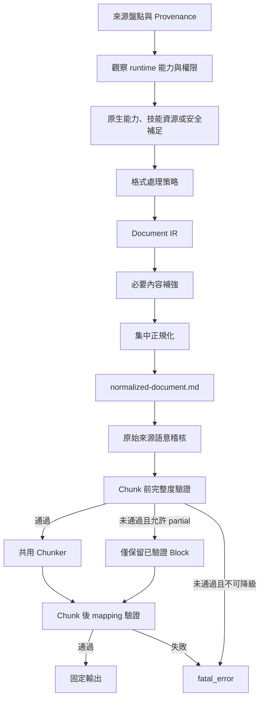

# 工作流程

## 目錄

1. Runtime-aware 固定管線
2. 能力判定與補足
3. 來源處理
4. 內容補強
5. Chunk 前閘門
6. 共用 Chunker
7. Chunk 後閘門
8. 狀態轉移

## 一、Runtime-aware 固定管線

## 二、能力判定與補足

Agent 不得依平台名稱或使用者本機狀態假定能力。依下列順序選擇路徑：

1. 使用目前介面明確提供、已授權或前一步已成功的能力。
2. 調用技能包中的 scripts、references、assets 與目前已存在的工具。
3. 若已確認範圍隔離、受限且可回復，自行安裝缺少相依並實測。
4. 嘗試可保留等效來源證據的替代能力。
5. 所有安全路徑不足時才使用既有原因欄位記錄 `needs_capability` 或 `needs_source`。

不得要求使用者自行安裝或執行 Agent 可調用的資源。持久或共享環境不得修改全域設定、移除或升級無關相依。

## 三、來源處理

1. 檢查檔案或目錄是否存在。
2. 安全展開 ZIP，拒絕路徑穿越。
3. 遞迴展開巢狀 ZIP。
4. 只保留支援副檔名。
5. 以 SHA-256 去重，保存 canonical 與 duplicate 對應。
6. 讀取 magic bytes 及 runtime MIME。
7. 比對 requested media type 及 runtime media type。
8. 依副檔名選擇 Adapter，並將實際 Adapter 寫入 Provenance。

## 四、內容補強

Agent 先使用目前最能保留來源語意、結構、頁面或時間範圍證據的路徑。只有必要內容缺失時才進入補強：

1. QR Code 或 Barcode 專用 Decoder。
2. 標準 OCR。
3. 失敗區域的 Crop、Deskew、Contrast、Adaptive threshold 及語言調整。
4. 替代 parser、OCR backend、文件理解或影音處理能力。
5. 若可用，可加入非逐字 LLM 圖形摘要，但不得冒充 OCR。

一般模式最多三次。Forensic 模式最多五次，且要保存各次參數與中間產物。

## 五、Chunk 前閘門

先建立完整 `document-ir.jsonl` 及 `normalized-document.md`，再計算：

- 來源單元對帳率。
- 必要內容涵蓋率。
- 關鍵內容涵蓋率。
- 文字、表格、視覺及結構涵蓋率。
- 標準化 Markdown 的內容品質。
- 原始 XML 可見屬性、HTML 非標準清單直接子內容及 Table Caption 的獨立來源語意稽核。

上述 XML、HTML、Caption 與 OCR 是已知回歸案例。相同的來源範圍、語意、結構、頁面、時間範圍與可回溯證據原則，適用所有既有格式。

關鍵內容失敗、沒有有效主體內容、來源無法對帳或標準化文件不可信時，直接 `fatal_error`。

原始來源語意稽核不依賴 Adapter 自報。缺少關鍵 XML 程序語意直接 `fatal_error`；缺少必要但非關鍵的非標準 HTML 清單或 Caption 至少為 `partial_success`。

必要非關鍵內容未達 95％時為 `partial_success`。預設不切片，只有 `--allow-partial-chunks` 可對成功 Block 產生 partial Chunk。

## 六、共用 Chunker

Chunker 的唯一輸入是標準化 Markdown 與已驗證 Document IR。Adapter 不得傳入原始 PDF、DOCX、HTML、圖片或影片。

切片順序：

1. Heading 邊界。
2. Block 原子性。
3. 目標 Token 範圍。
4. 可讀的 Heading context。
5. 非原子文字 Block 的有限 overlap。

## 七、Chunk 後閘門

比較合格 Block ID 集合與 Chunk mapping：

- 每個合格 Block 必須至少出現一次。
- 非 overlap Block 不得重複映射。
- failed 或 low_quality Block 不得進入 Chunk。
- Chunk 的 normalized document hash 必須一致。
- 每個 Chunk 必須有 Heading context。
- atomic unit violation 必須為 0。

## 八、狀態轉移

| 前置閘門 | `--allow-partial-chunks` | Chunk 後閘門 | 最終狀態 |
|---|---:|---|---|
| success | 任意 | passed | success |
| partial_success | false | not_run | partial_success |
| partial_success | true | passed | partial_success |
| fatal_error | 任意 | not_run | fatal_error |
| success 或 partial_success | 任意 | failed | fatal_error |

`success` 等同可驗證的 `complete`。若有可靠部分產物，但所有安全可行能力或來源仍不足，維持 `partial_success` 並在既有 `partial_reasons` 記錄 `needs_capability` 或 `needs_source`。若沒有可靠主體內容，維持 `fatal_error` 並在既有 failure reason 記錄同一原因。
