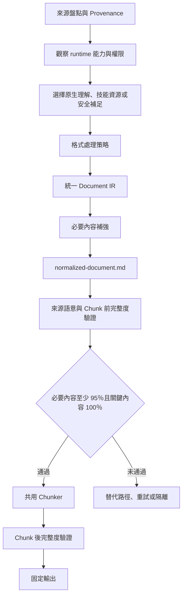

# Multiformat RAG Chunker

> **v1.2.3｜2026-08-12**：正式凍結 capability handshake、共用 OCR admission、逐 asset routing evidence、每來源切片策略對焦、未洩題獨立驗證、fixture 非產品規則與 dense `llm_visual_text` 正規化保護。完整承接 v1.2.2 的統一多格式範圍、固定七類輸出、Document IR、Token 與 overlap 預設、三次 OCR 策略、OCR 語言及退出碼契約。歷代版本、失敗候選與遷移紀錄只保留於 `FROZEN.md` 與 `references/migration-report.md`，不重複載入一般 RAG 任務。

## 目的

將每個來源獨立轉換成可稽核的 RAG 資料。原始來源不得直接進入 Chunker。Agent 依來源特性與當前 runtime 能力建立統一 Document IR 及 `normalized-document.md`，通過內容完整度閘門後，才產生正式 Chunk。

使用者只需提供來源檔與任務要求。Python、LibreOffice、FFmpeg、Tesseract、OCR、影音、轉檔與連接器是 Agent 依當前能力主動選擇的資源，不是使用者必須自行安裝或執行的前置。

## 統一多格式優先原則

- PDF、DOCX、DOC、HTML、HTM、XML、CSV、Markdown、MP4、JPG、JPEG、PNG、HEIF、HEIC、ZIP、巢狀 ZIP 及目錄都是第一級輸入路由。不得因最新修補、示例或驗收檔使用 PDF，就把 Skill 解讀成 PDF 優先或 PDF 專用。
- 先盤點每個實際來源，再依副檔名、MIME、magic bytes、來源結構與當前 runtime 能力選擇相符 Adapter。混合目錄、ZIP 與巢狀 ZIP 必須逐 member 路由，不得把一個格式的條件式流程套到其他格式。
- 所有格式共用來源身份、Document IR、標準化、完整度、Chunk、固定七類輸出與驗證契約。格式 Adapter 只負責忠實解析，不得改寫共用 Chunk 規則或服務範圍。
- PDF 視覺、掃描頁來源對照與 dense-text 雙 Agent admission 是條件式格式分支。只有實際來源是 PDF，且內容或任務命中對應條件時才啟用；其他格式沿用自己的原生解析、圖片、影音、collection 與降級路徑。

## 切片策略對焦

- 在正式切片前，先檢查每份來源的章節階層、語意單元、表格與清單原子性、內容密度，以及使用者要求的檢索情境。若使用者未指定檢索粒度，依來源內容提出最可能的查詢單元並明示這項推論。
- 目標 1,000 至 1,400 Token 與約 100 Token overlap 是相容預設，不是免評估的固定答案。若預設值會把不同章節、不同詞條、問答、步驟或其他獨立查詢單元混入同一 Chunk，或讓短文件的重要 Heading 邊界失效，必須在產生正式輸出前主動提出每份來源的替代 min／max Token、overlap、細緻度、理由與 retrieval 取捨。
- 不同來源可採不同設定。不得為了統一參數而犧牲 Heading 邊界或原子 Block，也不得只為追求較小 Chunk 而拆開表格列群、清單、程式碼、圖片語意或 dense-text 單元。
- 使用者確認替代設定後才套用。若使用者已明示不要停下詢問，使用最保守的語意邊界繼續，並在回報中列出採用值、推論與風險。預設適合時，簡短說明後直接執行。
- 獨立驗證只取得原始來源、全新 RAG 輸出與人類任務要求。不得提供 Producer 的預期路由、Chunk 數量、Block 數量、coverage、retrieval metrics、golden、sidecar、先前報告或 PASS 條件；Validation SubAgent 必須由原檔重新建立判準。

## v1.2.0-dev-r2 collection 開發範圍

- collection 是 ZIP、巢狀 ZIP 或目錄中的多成員來源協調層，不是新的單一檔案格式，也不假定所有 HTML／XML 都採相同網站結構。
- 先使用 generic collection inventory 保留 member、alias、資源與相對路徑。只有在可驗證的控制檔與標記成立時，才選用特定 collection profile；未識別來源一律回退 generic profile。
- 每個內容來源仍各自產生既有七類輸出。collection context 只能補入已驗證的階層、順序與關聯，不得把不同來源的正文無條件混成同一份文件。
- ZIP、巢狀 ZIP 與目錄先建立 Package IR。相同雜湊的 alias 保留獨立 member 身分與 virtual base path，且各自輸出來源目錄。
- `collection-report-<collection-id>.json` 是 collection 根目錄稽核報告，不取代或增加每個來源固定七類輸出。它只記錄 member catalog、profile、控制檔階層、跨檔關聯摘要、collection metrics 與 gate。
- `scripts/validate_collection.py INPUT OUTPUT` 以原始 HTML DOM、XML tree 與 member catalog 獨立重算 collection 關聯、順序與硬閘門。它不得只相信 Adapter 或 `collection-report` 自報資料。
- 詳細契約見 `references/collection-contract.md`；已完成與尚未完成的測試分別記錄於 `references/test-coverage.md`。

## v1.2.0 collection 與內部關聯復原範圍

- 正常 collection 輸入不需要 `collection-supplement.json`。Chunker 必須由原始 ZIP、目錄或巢狀 ZIP 的 member、雜湊、raw reference、fragment 與來源端標題／標籤自行建立解析證據。
- 精確相對路徑、`help::` URI 與副檔名替代維持第一優先。只有精確解析為 `source_missing_target` 時，才可嘗試本包內部復原，且不得跨 collection。
- 可接受的復原只有兩種：完全相同 bytes 的 alias source 能解析相同 raw reference，或唯一候選 member 同時具有所需 fragment 與完全相符的顯式標題／標籤。復原紀錄必須保留 target 與雜湊證據。
- 基於同檔名、模糊文字、OCR、視覺相似、其他版本、網路下載或 LLM 生成的猜測一律禁止。無候選、候選不唯一或證據不完整時維持 `source_missing_target`，collection 維持 `partial_success`。
- 非 Eclipse 真實異質 collection 是後續擴大回歸項目。它在未提供實檔時僅能標示為直接測試覆蓋不足，不能倒推本版已完成的既有格式、generic linked markup fixture、iTest 原包實測或凍結資格無效。
- r3 的 supplement manifest skeleton 是歷史候選，不是 r4 的使用者輸入或 runtime 依賴。iTest 的原包解析結果及驗收邊界見 `references/r4-internal-resolution-contract.md` 與 `references/r3-regression-plan.md`。

## 固定流程



完整流程及狀態轉移見 `references/workflow.md`。

圖片的 decoder、介面截圖、OCR 路由與 release gate 規則見 `references/image-semantics-gate.md`。只可把已驗證的機器載荷、通過既有 OCR 品質檢查的文字，或具來源與 asset SHA-256 證據的非逐字原生視覺摘要送入 Chunk。

## 輸入契約

支援：

- PDF、DOCX、DOC。
- HTML、HTM、XML。
- CSV、Markdown。
- MP4。
- JPG、JPEG、PNG、HEIF、HEIC。
- ZIP、巢狀 ZIP、目錄。

每個來源獨立處理。ZIP 展開後依 SHA-256 去重。禁止將不同來源的內容混進同一個來源目錄。

## Runtime-aware 執行方式

先觀察目前對話已暴露且已授權的檔案理解、視覺、程式、轉檔、OCR、影音、已安裝工具與連接器能力。能力可用的證據只能是目前介面明確提供、未改變持久環境的測試成功，或前一步已成功完成。

依序使用：原生能力、技能包資源、安全可自動補足的相依、等效能力。不可因使用者沒有手動安裝工具而跳過可行處理路徑，也不可要求使用者自行執行技能內的同一腳本。只有所有安全可行路徑都不足時，才依既有狀態欄位回報原因。

視覺內容必須以 `--capability-evidence` 完成 Agent 與腳本的 feature-detection 握手。能力未回報時是 `unknown`，不得自行改判為 `unavailable`。原生結構 parser 與 QR／Barcode decoder 仍先執行；需要視覺語意時，原生 LLM multimodal 可用就必須先完成 hash-bound review。只有 evidence 明確為 `unavailable`、`denied`、`unsupported`，或已實際嘗試 LLM 視覺且記錄失敗原因的 `failed`，共用 OCR admission 才可放行。

```bash
python scripts/rag_chunker.py INPUT -o OUTPUT --capability-evidence CAPABILITIES.json
```

每個受影響 asset 的 `selected_lane`、`llm_visual_attempted`、`ocr_admitted` 與理由都寫入既有 `processing-report.json` 的 `source_metadata.capability_routing`。不得新增第八類輸出，也不得只靠 OCR backend 是否存在決定能力優先序。

下列命令是 Agent 在當前 runtime 可實際執行且適合時可調用的 bundled resource，不是使用者操作說明。

### 全格式標準路徑

所有支援格式都先由同一個入口盤點並自適應路由：

```bash
python scripts/rag_chunker.py INPUT -o OUTPUT
```

### PDF 條件式視覺與 dense-text 路徑

以下規則只在實際來源是 PDF 且主要內容由掃描頁承載時適用，不是全格式的預設入口。Agent 當前已具有原生視覺能力時，必須先建立可重跑審核工作單，不得先以 OCR backend 缺失結案：

```bash
python scripts/prepare_visual_review.py INPUT.pdf -o REVIEW_WORK --json
```

若任務要求完整單字、音標、定義、片語或例句可檢索，必須使用 dense-text profile：

```bash
python scripts/prepare_visual_review.py INPUT.pdf -o REVIEW_WORK --profile dense_text --json
```

Extraction Agent 必須實際查看 `REVIEW_WORK/pages/` 中每個必要頁面，依 `visual-review-request.json` 產生 hash-bound `REVIEW.json`。不同的 Validation Agent 必須逐單元核對原頁，產生綁定 `REVIEW.json` SHA-256 的 `VALIDATION.json`。兩者完成後才可執行：

```bash
python scripts/rag_chunker.py INPUT.pdf -o OUTPUT --visual-semantics REVIEW.json --visual-text-validation VALIDATION.json
```

`semantic_summary` 回覆仍是非逐字摘要。Dense-text 回覆也是模型視覺轉錄，不得標為 `verbatim: true`；只有所有文字單元、閱讀順序、不確定片段與來源頁面都經獨立逐項驗證，才可成為 `llm_visual_text`。摘要不得冒充 dense-text corpus。

Sidecar schema、角色分離、欄位與 golden 契約見 `references/dense-text-contract.md`。

若 Agent 已確認當前 runtime 允許隔離且可回復的自動補足：

```bash
python scripts/rag_chunker.py INPUT -o OUTPUT --install-deps
```

允許不完整來源只對已驗證 Block 切片時：

```bash
python scripts/rag_chunker.py INPUT -o OUTPUT --allow-partial-chunks --partial-authorization explicit_user_request
```

`--allow-partial-chunks` 只有使用者明確允許不完整 Chunk 時可用。Producer Agent 不得自行授權；缺少 `explicit_user_request` 證據時，CLI 與 Validator 都必須拒絕。

要求原始二進位檔，禁止衍生 Markdown snapshot 降級時：

```bash
python scripts/rag_chunker.py INPUT -o OUTPUT --require-original-binary
```

Forensic 模式只供人工調查：

```bash
python scripts/rag_chunker.py INPUT -o OUTPUT --forensic
```

當原生視覺能力已實際可用且圖片語意是必要內容時，Agent 必須建立雜湊綁定的審核 sidecar，並執行：

```bash
python scripts/rag_chunker.py INPUT -o OUTPUT --visual-semantics REVIEW.json
```

`REVIEW.json` 是 Agent 的可稽核工作產物，不是使用者安裝工具或手動準備的前置；它必須同時比對 INPUT 與每張圖片的 SHA-256。

## 執行規則

### 零、能力補足與持久環境邊界

- 不得依產品名稱假定能力。Agent 必須依實際暴露的權限、隔離性、持久性、可回復性與前一步結果決定是否調用或補足能力。
- 在隔離 sandbox，或 Agent 已確認自己擁有受限且可回復的安裝範圍時，缺少相依應由 Agent 自行安裝並實測。
- 在持久或共享環境，優先使用既有工具、暫存路徑、工作區隔離環境或等效能力。不得修改全域設定、移除或升級無關相依。
- 安裝、權限、網路或政策阻擋時，必須嘗試等效能力；不得把可由 Agent 完成的步驟轉嫁給使用者。
- 每次能力選擇、安裝嘗試、等效路徑與失敗原因都必須保留在既有處理或驗證紀錄中。

### 一、先驗證來源身份

至少記錄使用者名稱、上傳名稱、runtime path、副檔名、MIME、magic bytes、SHA-256、實際 Adapter、原始二進位處理狀態、來源尺度及 derivation chain。

若使用者指定 PDF，但 runtime 實際只有 Markdown snapshot，必須標示：

```json
{
  "requested_media_type": "application/pdf",
  "runtime_media_type": "text/markdown",
  "original_binary_processed": false,
  "input_fidelity": "derived_snapshot"
}
```

此情況不得標示完整成功。詳細契約見 `references/adapter-contract.md`。

### 二、Adapter 只產生 Document IR

每個格式 Adapter 只解析來源並輸出統一 Document IR。禁止 Adapter 自行切片。共用 Block type 只有：

- `heading`
- `paragraph`
- `list`
- `table`
- `image`
- `code`
- `transcript`
- `placeholder`

Schema 見 `references/document-ir.md`。

### 三、原生解析優先，必要時才補強

只有原生內容缺失、掃描頁、必要圖片文字、無法取得的表格或資訊圖才執行 OCR。QR Code 及 Barcode 先使用專用 Decoder。Logo、裝飾圖、純照片及已被原生文字完整涵蓋的圖片不得強制 OCR。

一般模式每個失敗單元最多三次，且每次策略必須不同：

1. 原生解析或標準 OCR。
2. 只處理失敗區域，執行解析度、Crop、Deskew、Contrast、Adaptive threshold 及語言調整。
3. 替代 parser 或第二 OCR backend。LLM 視覺摘要只能標示為非逐字內容。

已授權的原生視覺理解若確認介面圖片或 PDF 掃描頁含有原生文字未涵蓋的必要概念，只可用來源 INPUT SHA-256、asset SHA-256 與 `native_visual_nonverbatim` 審核方法綁定的摘要補入。摘要不得逐字宣稱 OCR 結果、不得偽造 decoder payload，並必須成為單獨可檢索的原子 Chunk；未具此證據的 `screen_capture` 維持跳過且不得 OCR。PDF 掃描頁缺少審核且 OCR 失敗時，必須留下 `native_visual_review_required`，不得因同頁 QR／Barcode 成功而視為已有主體內容。

詳細失敗政策見 `references/failure-policy.md`。

### 四、先產生標準化 Markdown

集中執行 Unicode NFC、軟換行合併、頁首頁尾移除、重複內容處理、閱讀順序修復及 OCR 垃圾偵測。IPA、數學符號、程式碼及 combining marks 不得被粗暴移除。

每個來源先產生獨立 `normalized-document.md`。格式契約見 `references/normalized-markdown.md`。

### 五、Chunk 前完整度為硬閘門

成功條件固定為：

```text
source_unit_accounting_ratio = 1.0
required_content_coverage_ratio >= 0.95
critical_content_coverage_ratio = 1.0
source_semantic_audit = passed 或 not_applicable
primary_content.has_effective_main_content = true
dense_text.coverage_ratio = 1.0 或 not_applicable
沒有未揭露的必要單元失敗
normalized-document.md 通過格式及內容品質檢查
DOCX、DOC、PDF 的 layout_semantics_status = reliable
DOCX、DOC、PDF 的 document_title_semantics_status = reliable
```

沒有符合資格的影像或表格時，比例必須是 `null`，狀態必須是 `not_applicable`，不得輸出 1.0。

完整指標及判定見 `references/quality-gates.md`。

### 六、共用 Chunker 只讀標準化產物

Chunker 只能讀取：

```text
normalized-document.md
已驗證 Document IR
```

規則：

- Heading 邊界優先，保留父層與目前 Heading context。
- Chunk `heading_path` 必須等於所有非 overlap 來源 Block Heading path 的最長共同前綴，不得取最後一個 Block 的路徑。
- 表格、清單、程式碼、圖片及字幕時間片段視為原子 Block。
- 經雜湊綁定的 `llm_visual_summary` 必須保留為獨立 Chunk，避免長篇周邊內容稀釋必要圖片語意；每個來源 Block 仍只能映射一次。
- `llm_visual_text` 必須依一基制連續閱讀順序建立多個邏輯 Block。每個 Block 不得跨單元拆分，且 extraction 與獨立 validation manifest Hash 必須保留在 evidence。
- 小文件可產生單一短 Chunk，不得為了填滿 Token 重複正文。
- 目標為 1,000 至 1,400 Token，預設 overlap 約 100 Token。
- overlap 不得整塊複製表格、圖片 OCR、程式碼或完整清單。

### 七、Chunk 後再次驗證

必須確認所有合格 Block 都已映射、沒有合法 Block 被無聲遺漏、失敗 Block 未進入正式 Chunk、原子 Block 未被破壞、Chunk 沒有無來源內容，並由來源 Block 獨立重算 `heading_path` 驗證語意正確性。DOCX、DOC、PDF 若要回報 `success`，版面與文件標題語意都必須為 `reliable`，Validator 並須獨立驗證每個合格 Block 的閱讀順序、圖片與最近前置 Heading 的完整關聯，以及文件根標題語意。

成功條件固定為：

```text
chunk_block_mapping_ratio = 1.0
omitted_verified_blocks = 0
unexpected_chunk_content_count = 0
atomic_unit_violation_count = 0
orphan_heading_context_count = 0
reading_order_violation_count = 0
source_order_metadata_violation_count = 0
visual_heading_relation_violation_count = 0
document_title_mismatch_count = 0
```

### 八、依狀態交付

退出碼固定為：

| 狀態 | 退出碼 | 條件 |
|---|---:|---|
| `success` | 0 | 原始來源正確、Chunk 前及 Chunk 後閘門全部通過；DOCX、DOC、PDF 的版面及文件標題語意均為 `reliable`。 |
| `fatal_error` | 1 | 關鍵內容、來源對帳、標準化文件、Chunk mapping 或輸出驗證失敗。 |
| `partial_success` | 2 | 有可用內容，但必要非關鍵內容不完整、使用 snapshot，或使用者允許 partial chunks。 |

驗證失敗不得宣稱成功，也不得以 JSON Schema 通過代替內容完整性。

Dense-text PDF 完整交付另須執行：

```bash
python scripts/validate_against_source.py INPUT.pdf OUTPUT_SOURCE_DIR --require-complete --json
python scripts/validate_dense_retrieval.py OUTPUT_SOURCE_DIR --golden GOLDEN.json
```

關鍵 anchor、headword Recall@1、定義與例句 Recall@3、頁碼正確率任一未達 1.0，都不得宣稱完整單字級 corpus 已驗證。

## 固定輸出

每個來源目錄固定包含：

```text
output/
├── normalized-document.md
├── document-ir.jsonl
├── chunks/
│   └── *.md
├── chunks.jsonl
├── failed-items.jsonl
├── processing-report.json
└── manifest.json
```

完整欄位見 `references/output-schema.md`。

## 驗證

驗證單一來源輸出：

```bash
python scripts/validate_output.py OUTPUT_SOURCE_DIR --json
```

PDF 必須另外以原始來源重算頁數、掃描頁、空白頁、來源 Hash、主要 Block 與 Chunk mapping：

```bash
python scripts/validate_against_source.py INPUT.pdf OUTPUT_SOURCE_DIR --require-complete --json
```

開發回歸：

```bash
python -m unittest discover -s tests -v
python scripts/validate_punct.py SKILL.md
python scripts/validate_punct.py FROZEN.md
python scripts/validate_collection.py INPUT OUTPUT --json
```

任何驗證器退出碼非 0，均不得封裝為完成版。

## 能力邊界

- 不使用付費 API，不破解加密或密碼保護文件。
- OCR、LibreOffice、FFmpeg、Tesseract 及離線語音模型是否可用，取決於 Agent 實際探測、調用與安全補足的結果。工具名稱不是成功條件，缺少某個 backend 也不代表 Agent 已無可行路徑。
- LLM 視覺摘要不是逐字 OCR，必須使用 `content_origin: llm_visual_summary` 及 `verbatim: false`，並保存來源 INPUT SHA-256、asset SHA-256、審核 manifest SHA-256 與審核方法。
- Token 數為模型無關估算，不等同特定 embedding tokenizer 的精確值。
- DOCX 若大量內容位於 DrawingML 文字方塊，優先解析 OOXML Shape 文字；必要時才以 LibreOffice 轉 PDF，並記錄 derivation chain。
- DOCX 圖片只保證已支援的 inline、anchor 及 DrawingML 群組結構能建立邏輯閱讀順序與 Heading 關聯。相容性區塊中已有可解析 DrawingML Choice 的 VML fallback 不單獨觸發降級；實際依賴 VML、頁首頁尾圖片、跨頁浮動物件及未覆蓋的巢狀群組則必須降級或人工稽核。
- DOC 先以 LibreOffice 轉成 DOCX，再沿用 DOCX 的閱讀順序、圖文關聯及標題語意驗證。轉換失敗或版面語意無法可靠保留時，不得回報完整成功。
- PDF 以頁面座標、Heading cluster 與 Block 類型建立邏輯順序。偵測到左右欄重疊、巢狀版面或資訊圖等無法可靠重建的情況時，必須標示 `needs_review` 並降級。程式未崩潰不等於來源忠實度已證明。
- `success` 表示本契約的 `complete`。有可靠部分產物但欠缺能力或來源時，維持 `partial_success`，並在既有 `partial_reasons` 記錄 `needs_capability` 或 `needs_source`。沒有可可靠交付的主體內容時，維持 `fatal_error`，並在既有 failure reason 記錄相同原因。
- QR／Barcode 是已驗證機器載荷，但來源另有未完成的主要正文時，不得單獨滿足主體內容閘門。只有來源本身確實只含機器載荷，且沒有未解決主要單元時，才可視為有效主體。

## 維護與凍結

- v1.2.3 完整承接 v1.2.2 及 dev-r1、dev-r2、dev-r3 的已驗證契約；一般 RAG 任務不得為了版本沿革載入歷史文件。
- 修改、驗證、封裝、凍結或升版前，必須閱讀 `FROZEN.md` 與 `references/migration-report.md`，確認相容契約、失敗候選及遷移邊界。
- 歷代來源樹、候選 ZIP、SHA-256、失敗報告與驗收證據不得覆寫或改名；正式 v1.2.3 的後續程式、契約、輸出行為或高權重路由語意變更至少另開 v1.2.4 開發版。
- 破壞外部契約的修改必須另開 major 版本。

## 資源索引

- `scripts/rag_chunker.py`：主流程與 CLI。
- `scripts/intake.py`：來源盤點、安全解壓、去重及 Provenance。
- `scripts/models.py`：Document IR、Block、Chunk 及失敗資料模型。
- `scripts/adapters/`：各格式 Adapter。
- `scripts/normalize.py`：集中正規化。
- `scripts/ocr.py`、`scripts/visual.py`：選擇性 OCR、視覺分類及 Decoder。
- `scripts/visual_semantics.py`：雜湊綁定的非逐字原生視覺摘要審核。
- `scripts/visual_review.py`、`scripts/prepare_visual_review.py`：建立可重跑的 PDF 掃描頁資產與審核工作單。
- `scripts/validate_against_source.py`：以原始 PDF 獨立重算頁面與主要內容對照。
- `scripts/validate_dense_retrieval.py`：驗證 dense-text anchor、headword、定義、例句與頁碼 Recall。
- `scripts/verify_visual_retrieval.py`：全 corpus 的 deterministic visual retrieval smoke。
- `scripts/coverage.py`：Chunk 前完整度閘門。
- `scripts/chunker.py`：共用 Chunker 及 Chunk 後 mapping 驗證。
- `scripts/output.py`、`scripts/validate.py`：固定輸出、hash 與最終驗證。
- `scripts/relationship_resolver.py`：精確解析與原包內部關聯復原；不讀取使用者 manifest。
- `scripts/supplement_manifest.py`：r3 的未接入歷史候選，r4 runtime 不使用。
- `references/dependencies.md`：相依與降級路徑。
- `references/dense-text-contract.md`：dense-text extraction、獨立 validation sidecar 與 golden 契約。
- `references/test-coverage.md`：凍結格式的目前回歸覆蓋與未證明缺口。
- `references/r4-internal-resolution-contract.md`：原包 alias 與唯一語意目標的復原證據及拒絕規則。
- `references/r3-regression-plan.md`：r2 問題防回歸登錄與異質實檔驗收矩陣。
- `tests/`：跨格式及實檔回歸測試。
