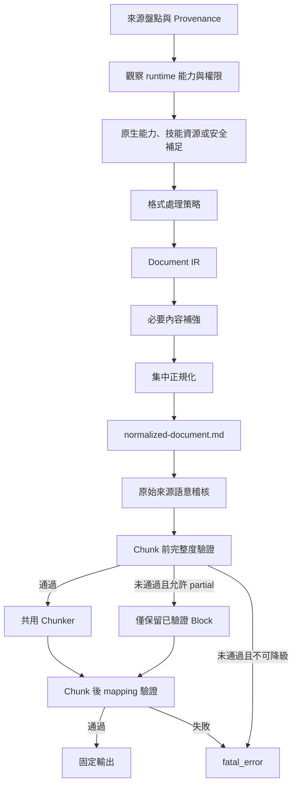

# 工作流程

## 目錄

1. Runtime-aware 固定管線
2. 能力判定與補足
3. 來源處理
4. 內容補強
5. Chunk 前閘門
6. 共用 Chunker
7. Chunk 後閘門
8. 狀態轉移

## 一、Runtime-aware 固定管線

## 二、能力判定與補足

Agent 不得依平台名稱或使用者本機狀態假定能力。依下列順序選擇路徑：

1. 使用目前介面明確提供、已授權或前一步已成功的能力。
2. 調用技能包中的 scripts、references、assets 與目前已存在的工具。
3. 若已確認範圍隔離、受限且可回復，自行安裝缺少相依並實測。
4. 嘗試可保留等效來源證據的替代能力。
5. 所有安全路徑不足時才使用既有原因欄位記錄 `needs_capability` 或 `needs_source`。

不得要求使用者自行安裝或執行 Agent 可調用的資源。持久或共享環境不得修改全域設定、移除或升級無關相依。

### Capability handshake 與 OCR admission

Agent 以 `--capability-evidence CAPABILITIES.json` 將原生 LLM multimodal feature detection 傳給腳本。沒有檔案時狀態是 `unknown`，不能推定為 `unavailable`。視覺補強順序固定為：原生結構 parser、QR／Barcode decoder、hash-bound LLM 視覺、具 admission 的 OCR、其他等效路徑。

OCR admission 只接受四種 evidence：明確 `unavailable`、權限 `denied`、媒體或介面 `unsupported`，以及具 `llm_visual_attempted: true` 與失敗原因的 `failed`。`available`、`unknown` 或只有 Tesseract 不在 PATH 都不得放行 OCR。每個 asset 的選路結果寫入既有報告，Validator 由 IR 與 routing event 交叉核對。

## 三、來源處理

1. 檢查檔案或目錄是否存在。
2. 安全展開 ZIP，拒絕路徑穿越。
3. 遞迴展開巢狀 ZIP。
4. 只保留支援副檔名。
5. 以 SHA-256 去重，保存 canonical 與 duplicate 對應。
6. 讀取 magic bytes 及 runtime MIME。
7. 比對 requested media type 及 runtime media type。
8. 依副檔名選擇 Adapter，並將實際 Adapter 寫入 Provenance。

## 四、內容補強

Agent 先使用目前最能保留來源語意、結構、頁面或時間範圍證據的路徑。只有必要內容缺失時才進入補強：

1. QR Code 或 Barcode 專用 Decoder，機器載荷與主要視覺內容分開對帳。
2. 當前已授權的原生視覺能力。PDF 掃描頁必須先產生 hash-bound 頁面工作單。語意摘要由 Agent 審核；dense-text 必須由 Extraction Agent 逐單元轉錄，再由不同 Validation Agent 全量核對，兩份 sidecar 都通過後才接回 Document IR。
3. 需要逐字內容、沒有原生文字，且 capability evidence 已通過共用 OCR admission 時，執行標準 OCR。
4. 失敗區域的 Crop、Deskew、Contrast、Adaptive threshold 及語言調整。
5. 替代 parser、OCR backend、文件理解或影音處理能力。

一般模式最多三次。Forensic 模式最多五次，且要保存各次參數與中間產物。

## 五、Chunk 前閘門

先建立完整 `document-ir.jsonl` 及 `normalized-document.md`，再計算：

- 來源單元對帳率。
- 必要內容涵蓋率。
- 關鍵內容涵蓋率。
- 文字、表格、視覺及結構涵蓋率。
- 標準化 Markdown 的內容品質。
- 原始 XML 可見屬性、HTML 非標準清單直接子內容及 Table Caption 的獨立來源語意稽核。
- Dense-text 頁面 coverage、獨立 validation status、unit ID 唯一性與一基制連續閱讀順序。

上述 XML、HTML、Caption 與 OCR 是已知回歸案例。相同的來源範圍、語意、結構、頁面、時間範圍與可回溯證據原則，適用所有既有格式。

關鍵內容失敗、沒有有效主體內容、來源無法對帳或標準化文件不可信時，直接 `fatal_error`。QR／Barcode 不得掩蓋同一來源仍存在的未解決主要正文。

原始來源語意稽核不依賴 Adapter 自報。缺少關鍵 XML 程序語意直接 `fatal_error`；缺少必要但非關鍵的非標準 HTML 清單或 Caption 至少為 `partial_success`。

必要非關鍵內容未達 95％時為 `partial_success`。預設不切片，只有使用者明確允許，且 `--allow-partial-chunks --partial-authorization explicit_user_request` 同時存在時，才可對成功 Block 產生 partial Chunk。

## 六、共用 Chunker

Chunker 的唯一輸入是標準化 Markdown 與已驗證 Document IR。Adapter 不得傳入原始 PDF、DOCX、HTML、圖片或影片。

正式切片前，Agent 必須由來源章節階層、語意單元、表格與清單原子性、內容密度及預期查詢方式評估切片策略。1,000 至 1,400 Token 與約 100 Token overlap 是相容預設。若預設值會跨越有意義章節、合併多個獨立詞條或問答、讓短文件 Heading 邊界失效，或降低細粒度檢索，Agent 必須先向使用者提出每份來源的替代 min／max Token、overlap、細緻度、理由與取捨。不同來源不必共用相同設定；原子 Block 與語意完整性仍優先於追求較小數字。

切片順序：

1. Heading 邊界。
2. Block 原子性。
3. 目標 Token 範圍。
4. 可讀的 Heading context。
5. 非原子文字 Block 的有限 overlap。

Dense-text retrieval 不由 Chunk mapping 代替。完成 Chunk 後，必須以綁定來源與 extraction manifest 的 golden 驗證 headword Recall@1、定義與例句 Recall@3、關鍵 anchor 與頁碼正確率。

來源對輸出的獨立驗證不得取得 Producer 的預期路由、數量、coverage、retrieval metrics、golden、sidecar、先前報告或 PASS 條件。Validation SubAgent 只依原始來源、全新輸出與人類任務要求重新建立內容、章節、粒度、來源忠實度與遺漏判準。

## 七、Chunk 後閘門

比較合格 Block ID 集合與 Chunk mapping：

- 每個合格 Block 必須至少出現一次。
- 非 overlap Block 不得重複映射。
- failed 或 low_quality Block 不得進入 Chunk。
- Chunk 的 normalized document hash 必須一致。
- 每個 Chunk 必須有 Heading context。
- atomic unit violation 必須為 0。

## 八、狀態轉移

| 前置閘門 | `--allow-partial-chunks` | Chunk 後閘門 | 最終狀態 |
|---|---:|---|---|
| success | 任意 | passed | success |
| partial_success | false | not_run | partial_success |
| partial_success | true | passed | partial_success |
| fatal_error | 任意 | not_run | fatal_error |
| success 或 partial_success | 任意 | failed | fatal_error |

`success` 等同可驗證的 `complete`。若有可靠部分產物，但所有安全可行能力或來源仍不足，維持 `partial_success` 並在既有 `partial_reasons` 記錄 `needs_capability` 或 `needs_source`。若沒有可靠主體內容，維持 `fatal_error` 並在既有 failure reason 記錄同一原因。

PDF 掃描頁的原生視覺審核尚未完成時，`--allow-partial-chunks` 不得把 QR、Barcode 或檔名標題變成可交付的替代正文。
